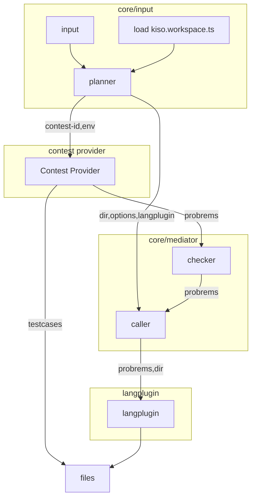

## directory

```
workspace/
  kiso.workspace.json
  */ # コンテストプロバイダ名
    */ # コンテスト名
      kiso.contest.json
      testcases/
        input/
          <test-id>.txt
        output/
          <test-id>.txt
      */ # lang-id
```

たとえばrustなら

```
workspace/
  kiso.workspace.ts
  templates/
    rust/
      probrems.rs
      Cargo.toml
  lib/
    rust/
      SegTree.rs
      Cargo.toml
  */ # コンテストプロバイダ名
    */ # コンテスト名
      .testcases/
        input/
          <test-id>.txt
        output/
          <test-id>.txt
      rust/ # lang-id
        bin/
          a.rs
          b.rs
          c.rs
          d.rs
          e.rs
          f.rs
          g.rs
        Cargo.toml
```

typescriptなら

```
workspace/
  kiso.workspace.ts
  templates/
    typescript/
      probrem.ts
      package.json
      tsconfig.json
  lib/
    typescript/
      packages/
        tree/
          src/
            segTree.ts
            segTree.test.ts
            lazySegTree.ts
            lazySegTree.test.ts
          package.json
          tsconfig.json
      package.json
      tsconfig.json
  */ # コンテストプロバイダ名
    */ # コンテスト名
      .testcases/
        input/
          <test-id>.txt
        output/
          <test-id>.txt
      typescript/ # lang-id
        src/
          a.ts
          b.ts
          c.ts
          d.ts
          e.ts
          f.ts
          g.ts
        tsconfig.json
        package.json
```

## command

### kiso new

```bash
kiso new <contest-name> [--p] <provider-id> [--lang --l] <lang-1> <lang-2> <lang-3...> [--langset -s] <langset-1> <langset-2> <langset-3...>
```

contestを作る。



## config

### kiso.workspace.ts

```ts
import { defineConfig } from "kiso";
import typescript from "@kiso/lang-typescript";
import rust from "@kiso/lang-rust"
import atcoder from "@kiso/prov-atcoder";
export default defineConfig({
  lang: {
    lang: [
        typescript(
          "typescript",
          {
            template:{
              dir:"templates/typescript"
            },
            library:{
              dir:"lib/typescript",
            }
            runtime:{ // unexpectedな'type'はフォールバックする
              runtimes:[{
                type:"bun",
                compile:false
              },{
                type:"node",
                compile:false
              }],
            templateDevEngine:"ignore" // "use" | "fallback" | "ignore"
            }
            compiler:{
                version:"7.0.2",
            }
            build:{
                type:"tsdown",
                templateVersion:"use",
                autoCopy:true
            }
        }),
        rust(
          "rust",
          {
            template:{
              dir:"templates/rust"
            },
            library:{
              dir:"lib/rust"
        }})],
    default: {
      lang: ["typescript"],
      extendWhenUseLangFlag:false,  // --lang で言語を指定した際にdefaultを無視するか継承するか
      extendWhenUseLangSetFlag:false
    },
    langSet:[
        {name:"all",flag:"a",langs:["typescript","rust"]}
    ]
  },
  contest: {
    env:".env" // atcoderのcookieなどの情報をworkspaceからの相対パスで指定する
    provider: [atcoder({ dir: "atcoder", flag: ["atcoder", "a"] })], //kiso new abc000 --p aのようにするとatcoder providerが起動する
    inferProviderByDirectory: true, // workspace/atcoderからkiso newを呼び出した際にatcoder providerを起動する
  },
});
```

## plugins

### langPlugin

プログラミング言語に対するプラグイン。ビルド、テスト、`<lang-id>/**`の構築、templateの管理、ライブラリの管理を行う

### contestPlugin

コンテスト開催システムに対するプラグイン。testcaseの収集、問題idの取得、`.env/<name>/**`の管理などを行う
